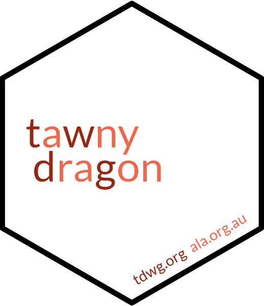

# tawnydragon </a>

<!-- <a href="https://galah.ala.org.au/Python/"> -->
<!-- badges: start -->

<!-- 
[](https://pypi.org/project/tawnydragon-python/)
-->
<!-- badges: end -->

**Easy Biodiversity Information Standards**

The [Biodiversity Information Standards](http://www.tdwg.org) Group -
commonly known as TDWG - develops and standards for sharing biodiversity
information. `{tawnydragon}` is a fast and tidy Python interface to those
standards.

The package name refers is one common name for *Ctenophorus decresii*, a
species whose common name happens to contain all of the letters in TDWG
(albeit not in order!)

To install from GitHub:

``` bash
pip install poetry 
git clone https://github.com/AtlasOfLivingAustralia/tawnydragon-python
cd /path/to/tawnydragon/directory
poetry install
```

You can use `tawnydragon` to show data from the TDWG information
hierarchy, which starts with `standards` and moves down through
`vocabularies`, `termlists` and finally `terms`. These are all 
ecompassed in one function, called `show_dwc_information`. 
To show available standards (including past
versions), for example, you use:

``` python
>>> import tawnydragon
>>> tawnydragon.show_dwc_standards(infotype="standards")
   code        date  ...       status                                                key
0   450  2023-09-18  ...  recommended  http://www.tdwg.org/standards/450/version/2023...
1   450  2023-09-13  ...   superseded  http://www.tdwg.org/standards/450/version/2023...
2   638  2023-09-05  ...  recommended  http://www.tdwg.org/standards/638/version/2023...
3   450  2023-07-07  ...   superseded  http://www.tdwg.org/standards/450/version/2023...
4   450  2023-06-28  ...   superseded  http://www.tdwg.org/standards/450/version/2023...
5   638  2023-04-26  ...   superseded  http://www.tdwg.org/standards/638/version/2023...
6   638  2023-02-24  ...   superseded  http://www.tdwg.org/standards/638/version/2023...
7   638  2022-02-23  ...   superseded  http://www.tdwg.org/standards/638/version/2022...
8   638  2021-10-05  ...   superseded  http://www.tdwg.org/standards/638/version/2021...
9   450  2021-09-01  ...   superseded  http://www.tdwg.org/standards/450/version/2021...
10  450  2021-07-15  ...   superseded  http://www.tdwg.org/standards/450/version/2021...
11  450  2021-04-27  ...   superseded  http://www.tdwg.org/standards/450/version/2021...
12  450  2021-03-29  ...   superseded  http://www.tdwg.org/standards/450/version/2021...
13  638  2021-02-01  ...   superseded  http://www.tdwg.org/standards/638/version/2021...
14  638  2020-10-28  ...   superseded  http://www.tdwg.org/standards/638/version/2020...
15  450  2020-10-28  ...   superseded  http://www.tdwg.org/standards/450/version/2020...
16  638  2020-10-13  ...   superseded  http://www.tdwg.org/standards/638/version/2020...
17  450  2020-10-13  ...   superseded  http://www.tdwg.org/standards/450/version/2020...
18  638  2020-08-23  ...   superseded  http://www.tdwg.org/standards/638/version/2020...
19  450  2020-08-20  ...   superseded  http://www.tdwg.org/standards/450/version/2020...
20  450  2020-08-12  ...   superseded  http://www.tdwg.org/standards/450/version/2020...
21  638  2020-01-27  ...   superseded  http://www.tdwg.org/standards/638/version/2020...
22  450  2017-10-06  ...   superseded  http://www.tdwg.org/standards/450/version/2017...
23  147  2017-04-25  ...  recommended  http://www.tdwg.org/standards/147/version/2017...
24  642  2017-04-25  ...  recommended  http://www.tdwg.org/standards/642/version/2017...
25  450  2015-03-27  ...   superseded  http://www.tdwg.org/standards/450/version/2015...
26  450  2014-12-23  ...   superseded  http://www.tdwg.org/standards/450/version/2014...
27  450  2014-10-23  ...   superseded  http://www.tdwg.org/standards/450/version/2014...
28  638  2013-10-28  ...   superseded  http://www.tdwg.org/standards/638/version/2013...
29  450  2013-05-25  ...   superseded  http://www.tdwg.org/standards/450/version/2013...
30  450  2013-03-28  ...   superseded  http://www.tdwg.org/standards/450/version/2013...
31  450  2011-10-16  ...   superseded  http://www.tdwg.org/standards/450/version/2011...
32  150  2011-01-30  ...  recommended  http://www.tdwg.org/standards/150/version/2011...
33  450  2009-12-07  ...   superseded  http://www.tdwg.org/standards/450/version/2009...
34  450  2009-10-09  ...   superseded  http://www.tdwg.org/standards/450/version/2009...
35  449  2009-09-09  ...  recommended  http://www.tdwg.org/standards/449/version/2009...

[36 rows x 6 columns]
```

All funtions in `tawnydragon` return information in reverse chronological order (i.e. most recent first). For obvious reasons, these tibbles get larger the lower down in the hierarchy you go.

``` python
>>> tawnydragon.show_dwc_information(infotype="terms")
                   code        date     parent_class  ...   type       status                                                key
0                 Event  2023-09-18  No Parent Class  ...  class  recommended  http://rs.tdwg.org/dwc/terms/version/Event-202...
1        FossilSpecimen  2023-09-18  No Parent Class  ...  class  recommended  http://rs.tdwg.org/dwc/terms/version/FossilSpe...
2     GeologicalContext  2023-09-18  No Parent Class  ...  class  recommended  http://rs.tdwg.org/dwc/terms/version/Geologica...
3      HumanObservation  2023-09-18  No Parent Class  ...  class  recommended  http://rs.tdwg.org/dwc/terms/version/HumanObse...
4        Identification  2023-09-18  No Parent Class  ...  class  recommended  http://rs.tdwg.org/dwc/terms/version/Identific...
..                  ...         ...              ...  ...    ...          ...                                                ...
834  SamplingLocationID  2008-11-19         Location  ...   term   deprecated  http://rs.tdwg.org/dwc/terms/version/SamplingL...
835      StartTimeOfDay  2008-11-19            Event  ...   term   deprecated  http://rs.tdwg.org/dwc/terms/version/StartTime...
836               Taxon  2008-11-19  No Parent Class  ...  class   superseded  http://rs.tdwg.org/dwc/terms/version/Taxon-200...
837             TaxonID  2008-11-19            Taxon  ...   term   deprecated  http://rs.tdwg.org/dwc/terms/version/TaxonID-2...
838            binomial  2008-11-19            Taxon  ...   term   deprecated  http://rs.tdwg.org/dwc/terms/version/binomial-...

[839 rows x 9 columns]
>>> 

```

Of course, looking at all past and present terms for any standard is not especially useful; It makes more sense to choose a single standard and version, and show only those terms within it. You can choose only the terms that are `recommended` rather than `superseded`, 
so you know you have the latest terms for your Darwin Core data.

``` python
>>> tawnydragon.show_dwc_information(infotype="terms",recommended=True)
                  code        date     parent_class  ...   type       status                                                key
0                Event  2023-09-18  No Parent Class  ...  class  recommended  http://rs.tdwg.org/dwc/terms/version/Event-202...
1       FossilSpecimen  2023-09-18  No Parent Class  ...  class  recommended  http://rs.tdwg.org/dwc/terms/version/FossilSpe...
2    GeologicalContext  2023-09-18  No Parent Class  ...  class  recommended  http://rs.tdwg.org/dwc/terms/version/Geologica...
3     HumanObservation  2023-09-18  No Parent Class  ...  class  recommended  http://rs.tdwg.org/dwc/terms/version/HumanObse...
4       Identification  2023-09-18  No Parent Class  ...  class  recommended  http://rs.tdwg.org/dwc/terms/version/Identific...
..                 ...         ...              ...  ...    ...          ...                                                ...
209          datasetID  2017-10-06  No Parent Class  ...   term  recommended  http://rs.tdwg.org/dwc/terms/version/datasetID...
210   scientificNameID  2017-10-06            Taxon  ...   term  recommended  http://rs.tdwg.org/dwc/terms/version/scientifi...
211       taxonRemarks  2017-10-06            Taxon  ...   term  recommended  http://rs.tdwg.org/dwc/terms/version/taxonRema...
212      verbatimDepth  2017-10-06         Location  ...   term  recommended  http://rs.tdwg.org/dwc/terms/version/verbatimD...
213  verbatimElevation  2017-10-06         Location  ...   term  recommended  http://rs.tdwg.org/dwc/terms/version/verbatimE...

[214 rows x 9 columns]
```